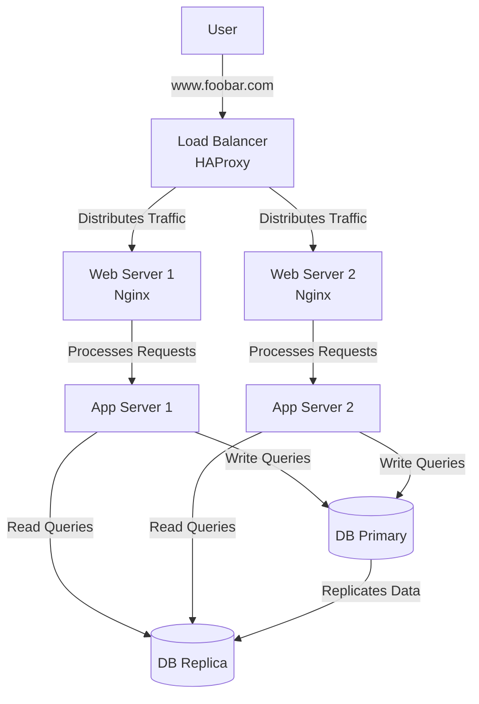

### Three-Server Web Infrastructure Design for www.foobar.com

#### **Infrastructure Diagram**


---

### **Component Roles & Justifications**

| Component          | Quantity | Why Added                                                                 | Role                                                                 |
|--------------------|----------|---------------------------------------------------------------------------|----------------------------------------------------------------------|
| **Additional Servers** | 2        | Eliminate web/app tier SPOF; handle increased traffic                     | Host redundant web/app server instances                              |
| **Load Balancer (HAProxy)** | 1        | Distribute traffic across servers; improve availability and performance   | Entry point for all requests; routes traffic to healthy servers      |
| **Web Servers (Nginx)** | 2        | Serve static content and proxy dynamic requests                           | Handle HTTP/HTTPS; terminate SSL; serve static files                 |
| **Application Servers** | 2        | Execute backend code with redundancy                                      | Process business logic; generate dynamic content                     |
| **Database Cluster** | 3 nodes  | Separate read/write operations; ensure data availability                 | Primary handles writes; replicas handle reads                       |
| **Application Files** | 1 set    | Single codebase deployed across all servers                               | Consistent business logic and functionality                          |

---

### **Specifics Explained**

1. **Load Balancer Distribution Algorithm**  
   - **Algorithm**: Round Robin (default)  
   - **How it works**:  
     ```mermaid
     graph LR
         LB[HAProxy] -->|Request 1| WS1[Server 1]
         LB -->|Request 2| WS2[Server 2]
         LB -->|Request 3| WS1
         LB -->|Request 4| WS2
     ```
     Distributes requests sequentially across all healthy servers. Equal traffic distribution with minimal overhead.

2. **Active-Active vs Active-Passive**  
   | **Active-Active**                     | **Active-Passive**                     |
   |---------------------------------------|----------------------------------------|
   | All servers handle live traffic       | Standby servers idle until failure     |
   | Maximizes resource utilization       | Wasted capacity during normal operation|
   | Requires synchronized sessions       | Simpler failover                      |
   | **Our Setup**: Active-Active (both web/app servers process requests) | |

3. **Database Primary-Replica Cluster**  
   ```mermaid
   graph LR
       P[Primary DB] -->|Asynchronous<br>Replication| R1[Replica 1]
       P -->|Asynchronous<br>Replication| R2[Replica 2]
       style P fill:#74c476,stroke:#333
       style R1 fill:#6baed6,stroke:#333
       style R2 fill:#6baed6,stroke:#333
   ```
   - **Primary**: Handles all write operations (INSERT/UPDATE/DELETE)  
   - **Replicas**: Serve read-only queries (SELECT); receive replicated data  
   - **Sync**: Asynchronous replication (primary doesn't wait for replica confirmation)

4. **Primary vs Replica in Application**  
   | **Primary**                          | **Replica**                            |
   |--------------------------------------|----------------------------------------|
   | Receives ALL write operations        | Handles read-only queries              |
   | Application directs writes to primary| Application directs reads to replicas  |
   | Single point for data consistency    | Reduces load on primary                |
   | Failure requires failover procedure  | Failure automatically bypassed by LB   |

---

### **Infrastructure Issues**

| Issue Category | Specific Problem                                                                 | Impact                                                                 |
|----------------|----------------------------------------------------------------------------------|------------------------------------------------------------------------|
| **SPOF**       | Load Balancer (single HAProxy instance)                                          | Complete outage if LB fails                                            |
|                | Database Primary Node                                                            | Write operations fail during primary downtime                          |
| **Security**   | No firewall between tiers                                                        | Lateral movement risk if one server compromised                        |
|                | No HTTPS termination at LB                                                       | Data interception; compliance violations                               |
|                | Unencrypted DB replication traffic                                               | Sensitive data exposure                                                |
| **Monitoring** | No health checks beyond basic LB probes                                          | Failures may go undetected                                             |
|                | No metrics collection (CPU, memory, request rates)                               | Inability to predict scaling needs                                     |
|                | No centralized logging                                                           | Difficult troubleshooting                                              |

---

### **Critical Analysis**

**Why These Issues Matter**:
1. **SPOF in Load Balancer**:  
   - 100% outage if HAProxy fails (despite redundant backend servers)  
   - *Solution*: Add passive HAProxy node with keepalived/VRRP

2. **Database Primary SPOF**:  
   - Write operations completely fail during primary maintenance/failure  
   - *Solution*: Implement primary failover with tools like Orchestrator

3. **Security Deficiencies**:  
   - Without HTTPS: User credentials/session cookies exposed  
   - No firewall: Compromised web server → direct database access  
   - *Solution*:  
     - Terminate SSL at LB  
     - Deploy web application firewall (WAF)  
     - Encrypt replication with TLS

4. **Monitoring Gap**:  
   - Undetected failures lead to extended outages  
   - *Solution*: Implement Prometheus/Grafana + ELK stack  


