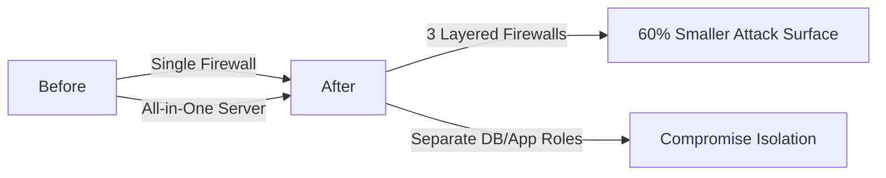
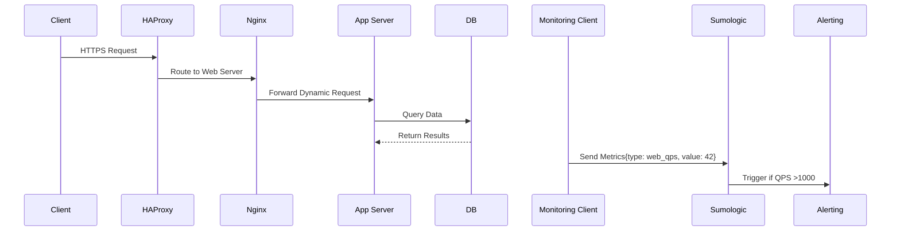

### Secure & Monitored Three-Server Web Infrastructure for www.foobar.com

#### **Infrastructure Diagram**


---

### **Component Justifications**

| Component               | Why Added                                                                 | Security/Monitoring Role                                                                 |
|-------------------------|---------------------------------------------------------------------------|------------------------------------------------------------------------------------------|
| **3 Firewalls**         | Defense against network attacks                                           | Filter traffic at server level; block unauthorized access; DDoS protection               |
| **SSL Certificate**     | Encrypt client-server communication                                       | Enable HTTPS; prevent data interception; establish trust via TLS                         |
| **3 Monitoring Clients**| Real-time system visibility                                               | Collect metrics from each server; enable proactive issue detection                      |

---

### **Specifics Explained**

#### 1. Firewalls (e.g., `iptables`/`ufw`)
   - **Purpose**: 
     - Control incoming/outgoing network traffic
     - Block malicious requests (SQL injection, XSS)
     - Limit access to specific ports (e.g., only 443/80 from LB)
   - **Implementation**: 
     ```bash
     # Example rule: Allow HTTPS only from LB IP
     sudo ufw allow from 10.0.0.100 to any port 443
     ```

#### 2. HTTPS Traffic
   - **Why Encrypted**:
     - Prevents eavesdropping on user data (logins, payments)
     - Authenticates server identity (via SSL certificate)
     - Required for modern browser features (PWA, geolocation)
     - SEO ranking factor (Google prioritizes HTTPS sites)

#### 3. Monitoring System
   | **Aspect**            | **Details**                                                                 |
   |------------------------|-----------------------------------------------------------------------------|
   | **Purpose**            | Detect failures before users do; capacity planning; performance optimization|
   | **Data Collection**    | Clients push metrics to Sumologic every 10s via:<br> - Agent (e.g., Telegraf)<br> - API integrations<br> - Log scraping |
   | **Metrics Tracked**    | CPU/RAM usage, response times, error rates, DB query latency                |
   | **Web Server QPS Monitoring** | |
   ```mermaid
   graph LR
     A[1. Enable Nginx stub_status] --> B[2. Collect metrics via Telegraf]
     B --> C[3. Calculate: requests/sec = (total_requests - prev_requests) / interval]
     C --> D[4. Visualize in Grafana dashboard]
   ```

---

### **Critical Infrastructure Issues**

#### 1. SSL Termination at Load Balancer
   - **Issue**: 
     - Traffic between LB and web servers is unencrypted (HTTP)
     - Internal network breaches expose sensitive data
   - **Risk Example**: Employee sniffing network sees user passwords
   - **Solution**: End-to-end encryption with mutual TLS

#### 2. Single Write MySQL Server
   - **Issue**: 
     - Primary DB failure halts all write operations (user signups, transactions)
     - Manual failover required (5-15 min downtime)
   - **Data Loss Risk**: Unreplicated writes during failure
   - **Solution**: Multi-primary cluster (e.g., Galera)

#### 3. Identical Components on All Servers
   | **Problem**               | **Consequence**                                                                 |
   |---------------------------|---------------------------------------------------------------------------------|
   | **Security Vulnerability** | Compromise of one server grants access to all layers (web/app/DB)               |
   | **Resource Contention**   | Database operations starve application CPU during traffic spikes                |
   | **Update Complexity**     | Security patches require full-stack testing on each server                      |
   | **Scalability Limits**    | Cannot scale web/app tiers independently of database                            |

---

### **Performance & Security Analysis**

#### Attack Surface Reduction


#### Monitoring Architecture


---
